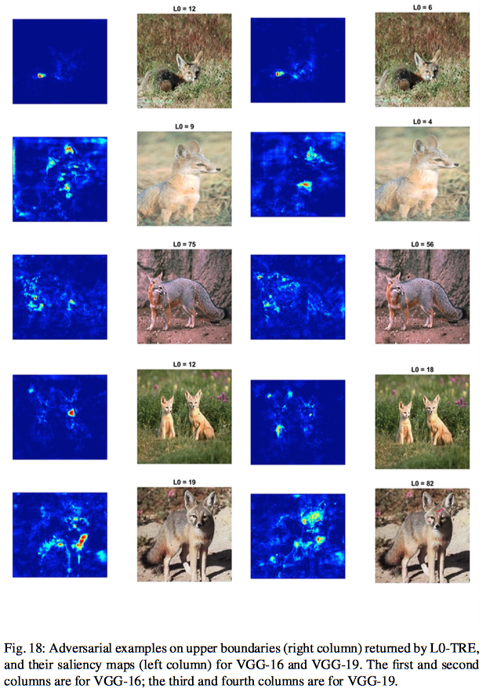

# DeepTRE (Tensor-based Robustness Evaluation of Deep Neural Networks for the Hamming Distance)

__Wenjie Ruan, Min Wu, Youcheng Sun, Xiaowei Huang, Daniel Kroening, Marta Kwiatkowska.__

_Global Robustness Evaluation of Deep Neural Networks with Provable Guarantees for the Hamming Distance_

The paper is accepted by the 28th International Joint Conference on Artificial Intelligence (IJCAI-19).
https://doi.org/10.24963/ijcai.2019/824

#### Citation
```
@inproceedings{ruan2019global,
  title     = {Global Robustness Evaluation of Deep Neural Networks with Provable Guarantees for the Hamming Distance},
  author    = {Ruan, Wenjie and Wu, Min and Sun, Youcheng and Huang, Xiaowei and Kroening, Daniel and Kwiatkowska, Marta},
  booktitle = {Proceedings of the Twenty-Eighth International Joint Conference on Artificial Intelligence, {IJCAI-19}},
  publisher = {International Joint Conferences on Artificial Intelligence Organization},            
  pages     = {5944--5952},
  year      = {2019},
  month     = {7},
  doi       = {10.24963/ijcai.2019/824},
  url       = {https://doi.org/10.24963/ijcai.2019/824},
}
```

--------------------------------

# Sample Results



-----------------------

# Developer's Platform
```
python 3.6.5
keras 2.1.5
tensorflow 1.7.0
numpy 1.14.2
matplotlib 2.2.2
scipy 1.0.1
```

# Run
```
python main.py
```

In main.py, set ` dataset = 'MNIST' ` or ` dataset = 'CIFAR10' `.


# Remark
This tool is under active development and maintenance, please feel free to contact us about any problem encountered.

Best wishes,

min.wu@cs.ox.ac.uk

