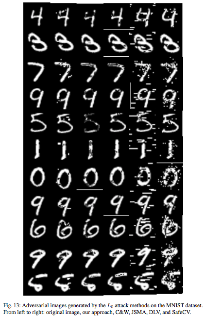
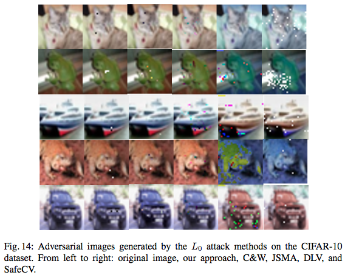

# L0-TRE (L0 Norm Tensor-based Robustness Evaluation)

Global Robustness Evaluation of Deep Neural Networks with Provable Guarantees for L0 Norm

Wenjie Ruan, Min Wu, Youcheng Sun, Xiaowei Huang, Daniel Kroening, Marta Kwiatkowska.

arXiv:1804.05805 https://arxiv.org/abs/1804.05805

# Sample Results



# Developer's Platform
python 3.6.5

keras 2.1.5

tensorflow 1.7.0

numpy 1.14.2

matplotlib 2.2.2

scipy 1.0.1

# Run
python main.py

In main.py, set dataset = 'MNIST' or 'CIFAR10'

# Citation
```
@ARTICLE{2018arXiv180405805R,
   author = {{Ruan}, Wenjie and {Wu}, Min and {Sun}, Youcheng and {Huang}, Xiaowei and {Kroening}, Daniel and 
	{Kwiatkowska}, Marta},
    title = "{Global Robustness Evaluation of Deep Neural Networks with Provable Guarantees for L0 Norm}",
  journal = {ArXiv e-prints},
archivePrefix = "arXiv",
   eprint = {1804.05805},
     year = 2018,
    month = apr,
   adsurl = {http://adsabs.harvard.edu/abs/2018arXiv180405805R}
}
```

# Remark
This tool is under active development and maintenance, please feel free to contact us about any problem encountered.
min.wu@cs.ox.ac.uk

Best wishes,

Min
